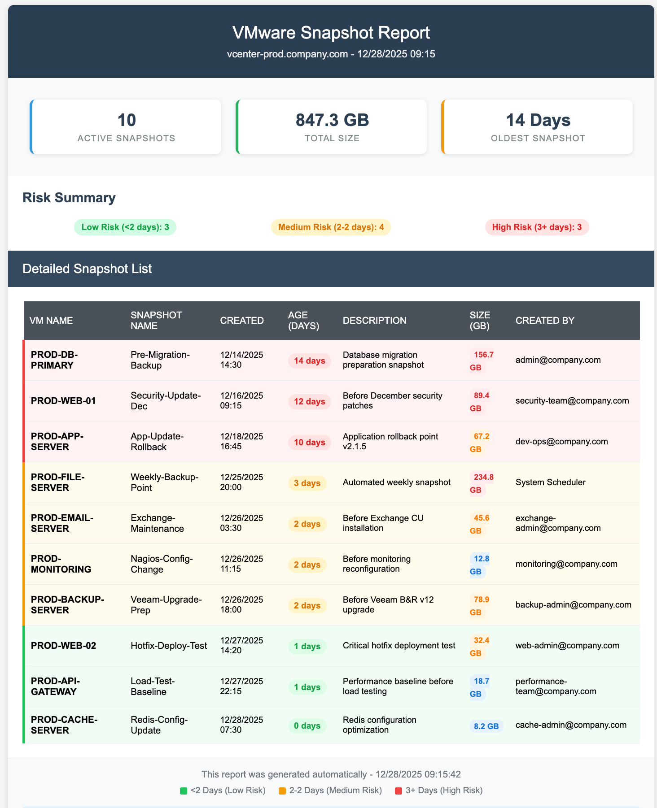

# VMware Snapshot Reporter

Automated VMware snapshot monitoring and reporting tool with color-coded HTML email reports, multi-vCenter support, and risk-based assessment.



## Features

- **Risk-Based Color Coding** — Green (<3 days), Yellow (3-7 days), Red (7+ days)
- **Multi-vCenter Support** — Scan multiple vCenter servers in a single run
- **Responsive HTML Reports** — Mobile-friendly email reports with executive summaries
- **Multiple Export Formats** — HTML, CSV, JSON, or All
- **Secure Credentials** — Encrypted credential files, environment variables, interactive prompt
- **TestMode** — Generate sample reports without vCenter connectivity
- **Configurable Thresholds** — Risk and size thresholds via `config.json`
- **CI/CD Ready** — Pester tests and GitHub Actions pipeline

## Requirements

- PowerShell 5.1 or later (PowerShell 7+ recommended)
- [VMware PowerCLI](https://developer.vmware.com/powercli) module
- Read-only access to vCenter Server
- SMTP server access for email notifications (optional)

## Quick Start

### 1. Clone the repository

```powershell
git clone https://github.com/canberkys/VMware-Snapshot-Reporter.git
cd VMware-Snapshot-Reporter
```

### 2. Install VMware PowerCLI (if not already installed)

```powershell
Install-Module VMware.PowerCLI -Scope CurrentUser
```

### 3. Configure

Copy the example configuration and edit with your values:

```powershell
Copy-Item config.example.json config.json
# Edit config.json with your vCenter and SMTP settings
```

### 4. Run

```powershell
# Test mode (no vCenter required)
.\VMware-Snapshot-Reporter.ps1 -TestMode

# Single vCenter
.\VMware-Snapshot-Reporter.ps1 -VCenterServer vcsa.lab.local

# Multiple vCenters with all export formats
.\VMware-Snapshot-Reporter.ps1 -VCenterServer vcsa01.lab.local, vcsa02.lab.local -ReportFormat All

# With email delivery
.\VMware-Snapshot-Reporter.ps1 -VCenterServer vcsa.lab.local -SendEmail

# Skip creator lookup for better performance
.\VMware-Snapshot-Reporter.ps1 -VCenterServer vcsa.lab.local -SkipCreatorLookup
```

## Configuration

### config.json

| Key | Description | Default |
|-----|-------------|---------|
| `vcenterServers` | Array of vCenter FQDNs/IPs | `[]` |
| `riskThresholds.highRiskDays` | Days threshold for high risk | `7` |
| `riskThresholds.mediumRiskDays` | Days threshold for medium risk | `3` |
| `sizeThresholds.largeGB` | GB threshold for large size badge | `50` |
| `sizeThresholds.mediumGB` | GB threshold for medium size badge | `10` |
| `email.smtpServer` | SMTP server address | `""` |
| `email.smtpPort` | SMTP port | `25` |
| `email.useSSL` | Enable SSL for SMTP | `false` |
| `email.from` | Sender email address | `""` |
| `email.to` | Array of recipient emails | `[]` |
| `email.cc` | Array of CC recipient emails | `[]` |
| `email.subjectTemplate` | Email subject template (`{0}` = vCenter name) | `"{0} Daily Snapshot Report"` |
| `poweredOnOnly` | Only scan powered-on VMs | `true` |
| `maxEventSamples` | Max vCenter events for creator lookup | `1000` |
| `sortBy` | Sort report by field | `"SizeGB"` |

### Parameters

| Parameter | Type | Description |
|-----------|------|-------------|
| `-VCenterServer` | `string[]` | vCenter server(s) to connect to |
| `-Credential` | `PSCredential` | vCenter credentials |
| `-ConfigFile` | `string` | Path to config.json |
| `-OutputPath` | `string` | Report output directory |
| `-ReportFormat` | `string` | `HTML`, `JSON`, `CSV`, or `All` |
| `-SendEmail` | `switch` | Send report via email |
| `-SkipCreatorLookup` | `switch` | Skip Get-VIEvent creator queries |
| `-TestMode` | `switch` | Use mock data, no vCenter needed |

## Credential Management

Credentials are resolved in this order:

1. **`-Credential` parameter** — Pass `PSCredential` directly
2. **Saved credential file** — Encrypted XML at `~/.snapshot-reporter-cred.xml`
3. **Environment variables** — `VCENTER_USERNAME` and `VCENTER_PASSWORD`
4. **Interactive prompt** — `Get-Credential` dialog

### Save credentials for automation

```powershell
# Save credential (encrypted, machine+user bound)
Get-Credential | Export-Clixml -Path ~/.snapshot-reporter-cred.xml
```

### Use environment variables (CI/CD)

```bash
export VCENTER_USERNAME="svc-snapshot@vsphere.local"
export VCENTER_PASSWORD="secure-password"
```

> **Note:** Encrypted XML credential files are bound to the machine and user that created them (DPAPI on Windows). Use environment variables for CI/CD or cross-machine automation.

## Project Structure

```
VMware-Snapshot-Reporter/
├── VMware-Snapshot-Reporter.ps1   # Main orchestrator
├── config.json                     # Configuration (gitignored values)
├── config.example.json             # Example configuration
├── checks/
│   ├── Get-SnapshotCreator.ps1     # Event-based creator lookup
│   ├── Get-SnapshotInventory.ps1   # Snapshot data collection
│   └── Invoke-RiskAssessment.ps1   # Risk/size classification
├── report/
│   └── New-HtmlReport.ps1          # HTML report + CSV/JSON export
├── output/                         # Generated reports (gitignored)
├── tests/
│   ├── Invoke-RiskAssessment.Tests.ps1
│   ├── Get-SnapshotInventory.Tests.ps1
│   └── VMware-Snapshot-Reporter.Tests.ps1
├── .github/workflows/ci.yml       # GitHub Actions CI pipeline
├── CHANGELOG.md
└── license.txt
```

## Scheduling

### Windows Task Scheduler

```powershell
$action = New-ScheduledTaskAction -Execute "pwsh.exe" -Argument "-File C:\Scripts\VMware-Snapshot-Reporter\VMware-Snapshot-Reporter.ps1 -SendEmail"
$trigger = New-ScheduledTaskTrigger -Daily -At "08:00AM"
Register-ScheduledTask -TaskName "VMware Snapshot Report" -Action $action -Trigger $trigger -RunLevel Highest
```

### Linux Cron

```bash
0 8 * * * /usr/bin/pwsh -File /opt/scripts/VMware-Snapshot-Reporter/VMware-Snapshot-Reporter.ps1 -SendEmail
```

## Running Tests

```powershell
# Install Pester (if needed)
Install-Module Pester -MinimumVersion 5.0 -Force

# Run all tests
Invoke-Pester ./tests -Output Detailed

# Run specific test file
Invoke-Pester ./tests/Invoke-RiskAssessment.Tests.ps1 -Output Detailed
```

## Migration from v2.0

If upgrading from the single-file v2.0 script:

1. Clone the new repository or pull the latest changes
2. Copy `config.example.json` to `config.json`
3. Move your vCenter server, SMTP settings, and thresholds to `config.json`
4. Remove hardcoded credentials — use one of the secure methods above
5. Replace `.\VMware-Snapshot-Reporter.ps1` with `.\VMware-Snapshot-Reporter.ps1 -SendEmail`

## License

[MIT](license.txt)

## Author

**Canberk Kilicarslan** — [GitHub](https://github.com/canberkys)
